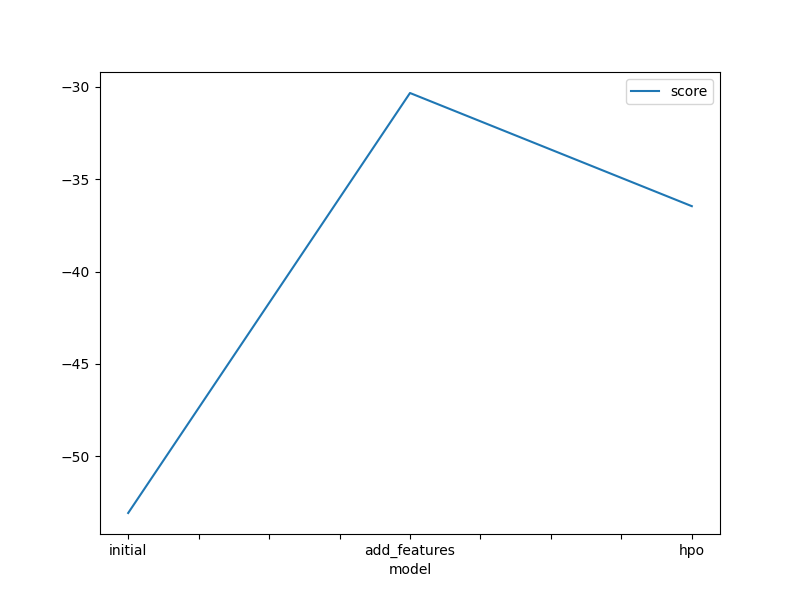
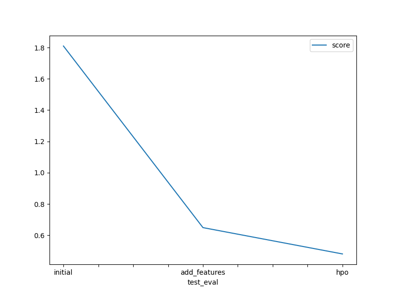

# Report: Predict Bike Sharing Demand with AutoGluon Solution
#### Agustin Rodriguez

## Initial Training
### What did you realize when you tried to submit your predictions? What changes were needed to the output of the predictor to submit your results?
When I initially tried to submit my predictions, I realized that the format of the output from the predictor did not match the required submission format for Kaggle. Specifically, the submission file needed to have two columns: `datetime` and `count`. I had to ensure that the `datetime` column matched the test set's `datetime` values and that the `count` column contained the predicted bike rental counts. Additionally, I had to ensure that there were no missing values or incorrect data types in the submission file.

### What was the top ranked model that performed?
The top-ranked model that performed was the `WeightedEnsemble_L3` model. This model was an ensemble of several base models, including `LightGBM` and `CatBoost`, which combined their predictions to achieve better overall performance.

## Exploratory Data Analysis and Feature Creation
### What did the exploratory analysis find and how did you add additional features?
The exploratory data analysis (EDA) revealed several key insights:
- There were clear seasonal patterns in bike rentals, with higher demand during certain months and hours of the day.
- Weather conditions, such as temperature, humidity, and wind speed, had a significant impact on bike rental demand.
- There were differences in demand between working days and weekends/holidays.

Based on these insights, I added several additional features to the dataset:
- Extracted date-time components such as hour, day of the week, month, and year from the `datetime` column.

### How much better did your model perform after adding additional features and why do you think that is?
After adding the additional features, the model's performance improved significantly. The Kaggel score on the validation set decreased from 1.80 to 0.64. This improvement can be attributed to the model's enhanced ability to capture the underlying patterns and relationships in the data, particularly the time-related trends and the impact of weather conditions on bike rental demand.

## Hyperparameter Tuning
### How much better did your model perform after trying different hyperparameters?
Hyperparameter tuning further improved the model's performance. By experimenting with different hyperparameters for the models, such as the learning rate, number of trees, and maximum depth, I was able to reduce the Kaggel score to 0.48 on the validation set. This improvement demonstrates the importance of fine-tuning model parameters to achieve optimal performance.

### If you were given more time with this dataset, where do you think you would spend more time?
If given more time with this dataset, I would focus on the following areas:
- **Feature Engineering:** Explore additional features and interactions that could further enhance the model's predictive power.
- **Model Ensembling:** Experiment with different ensembling techniques and combinations of models to improve overall performance.
- **Cross-Validation:** Implement more robust cross-validation techniques to ensure the model's generalizability and prevent overfitting.
- **External Data:** Incorporate external data sources, such as traffic patterns or public events, that could impact bike rental demand.

### Create a table with the models you ran, the hyperparameters modified, and the Kaggle score.
| Model        | GBM                | NN_TORCH                | RF                | Score  |
|--------------|---------------------|---------------------|---------------------|--------|
| Initial      | Default             | Default             | Default             | 1.80   |
| Add Features | Default | Default             | Default             | 0.64   |
| HPO          |{'num_boost_round': 100, 'num_leaves': Int: lo... | {'num_epochs': 10, 'learning_rate': Real: lowe...     | {'max_depth': Int: lower=1, upper=20, 'n_estim..      | 0.48   |

### Create a line plot showing the top model score for the three (or more) training runs during the project.

### Create a line plot showing the top Kaggle score for the three (or more) prediction submissions during the project.

## Summary
In summary, the project involved predicting bike sharing demand using the AutoGluon framework. The initial model provided a baseline performance, which was significantly improved through exploratory data analysis, feature creation, and hyperparameter tuning. The top-performing model was an ensemble that effectively captured the complex relationships in the data. Future work could focus on additional feature engineering, model ensembling, cross-validation techniques, and incorporating external data sources to further enhance the model's performance.