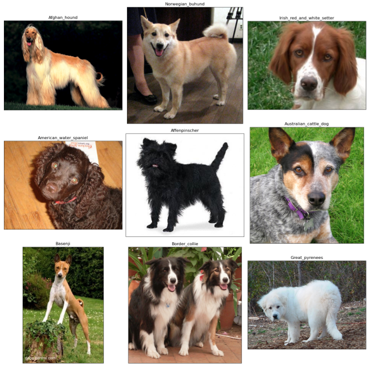
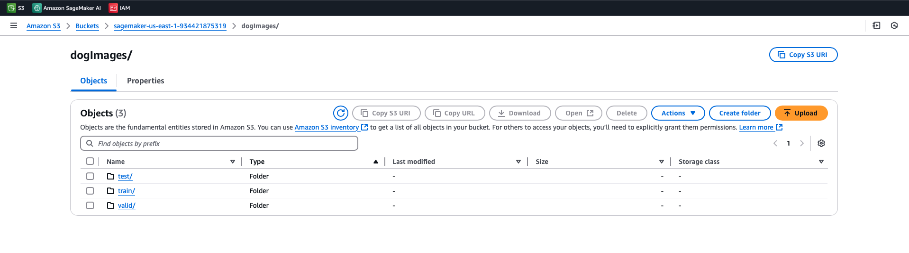
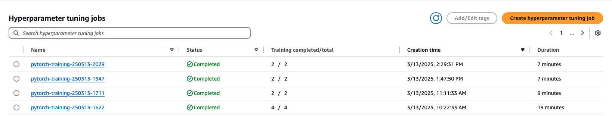
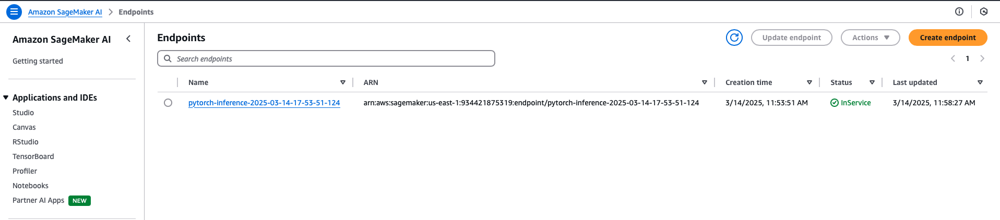
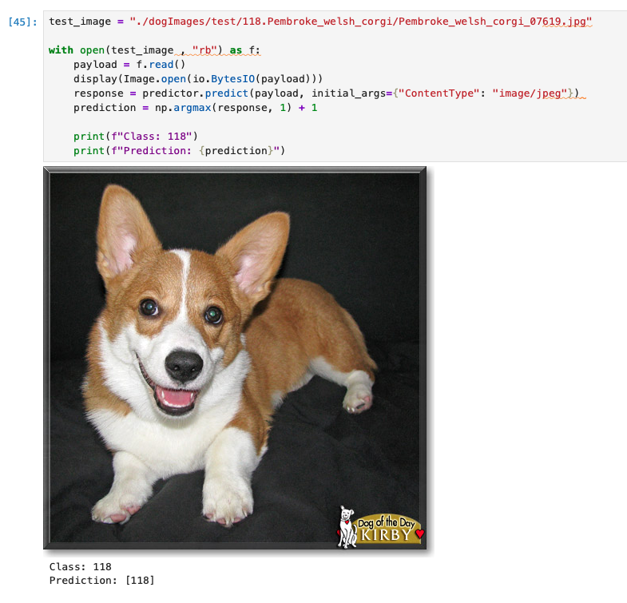

# Image Classification using AWS SageMaker

The aim of this project its to train, tune and deploy a ML model for image classification using AWS resources.

## Project Set Up and Installation
Create an AWS SageMaker notebook instances with the nesesary permissions for S3 and SageMaker endpoints.

## Dataset
The dataset consist of a training, test and validation datasets containing images of 133 dog breeads.



### Access
We can download and save the dataset to S3 with the following command:

```pyhon
!wget https://s3-us-west-1.amazonaws.com/udacity-aind/dog-project/dogImages.zip
!unzip -qq dogImages.zip
sagemaker_session.upload_data(path="dogImages", bucket=bucket, key_prefix='dogImages')
```



## Hyperparameter Tuning
I utilized a pretrained ResNet50 model and fine-tuned it by modifying the learning rate, epochs, and batch size. The learning rate affects how quickly the model converges to optimal weights, while the batch size influences the model's generalization ability by determining the number of samples propagated through the network. The number of epochs specifies how many times the model trains on the entire dataset. After determining the optimal hyperparameters, the model was trained using these configurations.

### Hyperparameter Jobs


### Training Jobs


The optimal hyperparameters obtained from tuning are:

```python
best_hyp = {'lr': 0.01873707665659153, 'batch_size': 32, 'epochs': 4}
```

## Debugging and Profiling
The training job was monitored using SageMaker Debugger built-in rules to evaluate various aspects of system performance and detect potential issues. The StepOutlier rule was triggered the most frequently, processing 984 datapoints, but did not detect any significant outliers. Other rules such as GPUMemoryIncrease, IOBottleneck, Dataloader, BatchSize, CPUBottleneck, LoadBalancing, MaxInitializationTime, and LowGPUUtilization were also evaluated, none of which detected issues during the training process. Key findings from the analysis include a mean step duration of 0.92s, a maximum step duration of 3.49s, and one outlier with a step duration larger than three times the standard deviation. Additionally, no significant issues related to GPU memory increase, data I/O wait times, data loader processes, batch size, CPU bottlenecks, workload balancing, initialization time, or GPU utilization were observed.

Possible causes for the detected step duration outlier might include system stall or bottleneck issues, which can be mitigated by checking for CPU or I/O bottlenecks correlated to the step outliers. If the GPUMemoryIncrease rule had detected issues, using a larger instance type with more memory could have been considered. To address potential IOBottleneck issues, pre-fetching data or using binary formats might improve I/O performance. Adjusting the number of data loader processes could help balance the workload on CPUs if the Dataloader rule had triggered. Increasing the batch size or considering a smaller instance type could mitigate GPU underutilization. Finally, increasing the number of data loaders or applying data pre-fetching could address any potential CPU bottlenecks, although no such issues were detected during this training job.


## Model Deployment
The endpoint was deployed via SageMaker Python API and tested with a image from the test set.

### Deployed endpoint


### Test
