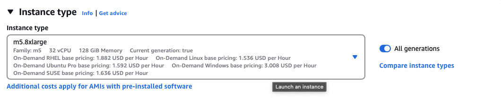

# Project 4

# Step 1
## Setup
Selected a `ml.t3.medium` for its balance between performance and cost.


## S3
Upload data to S3


## SM Endpoint


# Step 2

## EC2 Selection
For this step we can select a AMI with PyTorch and CUDA pre-installed, this 2 are infamously difficult to install from scratch.


I chose a `m5.xlarge` in order to speed up training.



## Model Training


# Step 3 Lambda

## Security

### Basic Execution


### SageMaker FullAccess


### Lambda Test

Response:
```json
{
  "statusCode": 200,
  "headers": {
    "Content-Type": "text/plain",
    "Access-Control-Allow-Origin": "*"
  },
  "type-result": "<class 'str'>",
  "Content-Type-In": "LambdaContext([aws_request_id=b4bff746-160b-40b0-b6f0-732b0f16fa58,log_group_name=/aws/lambda/lamb,log_stream_name=2025/03/17/[$LATEST]cecec15726384d6798857aab975a0dac,function_name=lamb,memory_limit_in_mb=128,function_version=$LATEST,invoked_function_arn=arn:aws:lambda:us-east-1:548231357293:function:lamb,client_context=None,identity=CognitoIdentity([cognito_identity_id=None,cognito_identity_pool_id=None])])",
  "body": "[[0.15395419299602509, 0.022549085319042206, 0.29828163981437683, 0.527239203453064, 0.2519504129886627, 0.22133924067020416, -0.022390242666006088, 0.36071333289146423, -0.2558196783065796, -0.18463005125522614, 0.3431830406188965, 0.6133803725242615, -0.18727907538414001, 0.3480810523033142, 0.32561197876930237, -0.07252064347267151, 0.3917020559310913, -0.24459567666053772, -0.19737029075622559, 0.2380392700433731, 0.27544769644737244, -0.35149309039115906, 0.4325679540634155, 0.36336255073547363, -0.12301699817180634, -0.0798475444316864, 0.4133394956588745, -0.19301806390285492, 0.2952417731285095, -0.10423558205366135, 0.10287521034479141, 0.3943004012107849, -0.42149829864501953, 0.571662962436676, 0.15819352865219116, 0.15584959089756012, -0.05147888511419296, 0.2957174479961395, 0.5167222619056702, 0.05289394408464432, 0.45038479566574097, 0.24684564769268036, 0.14015774428844452, 0.1387501209974289, 0.051568932831287384, 0.7234944701194763, 0.008496364578604698, 0.059362221509218216, -0.16521340608596802, 0.44875970482826233, 0.20948526263237, -0.30579885840415955, 0.17272859811782837, 0.586164116859436, -0.03256884217262268, 0.477884978055954, 0.3952072262763977, 0.13646215200424194, 0.2308340221643448, 0.05582822114229202, 0.12469077855348587, -0.09287713468074799, 0.014141526073217392, -0.06751886010169983, -0.04732344299554825, -0.5341249108314514, -0.6687979102134705, 0.43900156021118164, 0.1601221263408661, 0.19007399678230286, 0.32234060764312744, -0.21235792338848114, -0.2672850489616394, -0.1288823038339615, -0.0895863026380539, 0.045241694897413254, -0.302840918302536, -0.21224792301654816, 0.06898638606071472, -0.08469439297914505, -0.01842794008553028, 0.040601007640361786, -0.007301992736756802, 0.11966191977262497, -0.05401163920760155, 0.24608214199543, 0.2751622498035431, 0.26316970586776733, -0.18897993862628937, -0.2156812697649002, 0.183395653963089, 0.3576071560382843, -0.023326782509684563, -0.170762300491333, -0.13618670403957367, -0.35745272040367126, -0.0016762320883572102, 0.10959960520267487, -0.36242762207984924, -0.35554254055023193, 0.03948184475302696, -0.6131256222724915, 0.026658061891794205, -0.08403986692428589, -0.5245044231414795, -0.1495237648487091, -0.20521944761276245, -0.7692426443099976, -0.27282074093818665, -0.6093096733093262, -0.0029770666733384132, 0.023075969889760017, -0.024110836908221245, -0.3740580081939697, 0.3192896842956543, -0.6391653418540955, -0.01877322420477867, 0.2903241515159607, -0.38508227467536926, 0.24084201455116272, -0.8240596652030945, -0.7531700730323792, -0.09800945222377777, -0.09297782927751541, -0.10743919014930725, -0.1911744624376297, 0.02593623474240303, -0.5623040795326233, -0.07780183851718903, -0.048957016319036484, -0.5024768710136414, -0.6960750818252563, -0.46876320242881775]]"
}
```
### Vulnerability Assesment

Granting a Lambda function Full Access to AWS SageMaker can lead to significant security risks, such as over-privileged access, data leakage, and privilege escalation, which could compromise your entire AWS environment. It increases the attack surface by allowing malicious actors to exploit a single point of failure, consume excessive resources, or disrupt production. Additionally, auditing and monitoring become more challenging due to the broad permissions. To mitigate these risks, it's crucial to follow the principle of least privilege, limit permissions to specific actions, and implement strong logging, monitoring, and role segregation.

# Step 5 Auto

We can add autoscaling to our enpoint by specifiing the minimum and maximem amount of instances in the configuration section of the endpoint.

